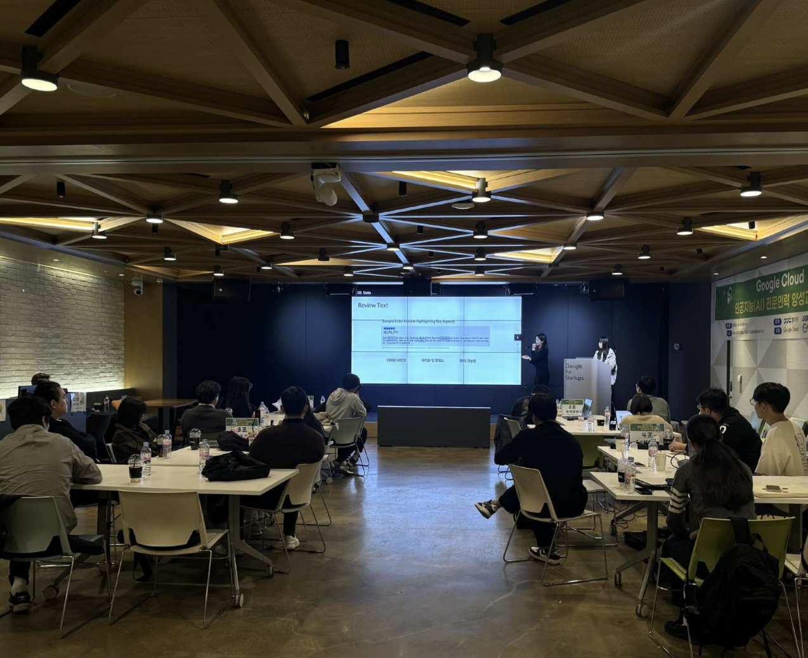

# 🍽️ EGMR-AI (이거먹을래)
### Everyone's Group Meal Recommendation Chatbot

> **"다 같이 뭐 먹을지 고민될 때, AI가 대신 골라드립니다!"**

EGMR-AI는 **다중 사용자의 취향을 고려해** 식사를 추천하는 대화형 AI 챗봇입니다.  
사용자의 메뉴 선호, 위치, 분위기 등을 바탕으로 LLM 기반 추천 모델이 최적의 식당을 제안하며, React 기반의 UI를 통해 자연스럽고 직관적인 사용자 경험을 제공합니다.


## 📑 발표자료

👉 [EGMR-AI 서비스 발표자료 보러가기](./LeeseoAn_Portfolio_EGMRAI.pdf)


## 📸 현장 스케치

| 🏆 수상 장면 | 💻 시연 장면 |
|-----------|------------|
|    |   |

## 📸 현장 스케치

<table>
  <thead>
    <tr>
      <th>🏆 수상 장면</th>
      <th>🖥️ 시연 장면</th>
    </tr>
  </thead>
  <tbody>
    <tr>
      <td>
        <br/>
        
      </td>
      <td>
        <br/>
        
      </td>
    </tr>
  </tbody>
</table>


## 🔧 프로젝트 구조
```bash
project-root/
├── README.md
├── requirements.txt          # Python 의존성
├── package.json              # (UI용) Node.js 의존성
├── package-lock.json
├── AI생성코드/
│   └── llm-chatbot/
│       ├── main.py
│       ├── config.py
│       ├── outline.txt
│       ├── api/
│       ├── data/
│       ├── models/
│       └── utils/
├── UI코드/
│   ├── index.js
│   ├── node_modules/
│   ├── package.json
│   ├── package-lock.json
│   └── egmr_ai/
├── 데이터수집코드/
│   ├── NaverReviewSentimentAnalysis.ipynb
│   ├── NaverWebCrawling_address_specific.ipynb
│   ├── NaverWebCrawling_category_menu.ipynb
│   └── NaverWebCrawling_metadata.ipynb
```

## 🧠 주요 기술 스택

- LLM: OpenAI GPT + KoSBERT 기반 임베딩
- 프레임워크: LangChain, FastAPI, Streamlit
- 데이터 수집: Selenium, BeautifulSoup, Pandas
- UI: React.js, Node.js
- 기타: Jupyter Notebook, VSCode

## 🚀 실행 방법

### 1. 📄 AI 서버 실행

```bash
cd AI생성코드/llm-chatbot
pip install -r requirements.txt
python main.py
```

### 2. 📄 UI 서버 실행
```bash
cd UI코드
npm install
npm run dev
```

### 3. 📄 gitignore 설정

아래 파일 및 폴더는 Git에 포함하지 않도록 `.gitignore` 파일에 추가되어 있습니다:
```bash
node_modules/
.ipynb_checkpoints/
pycache/
.env
.DS_Store
```


